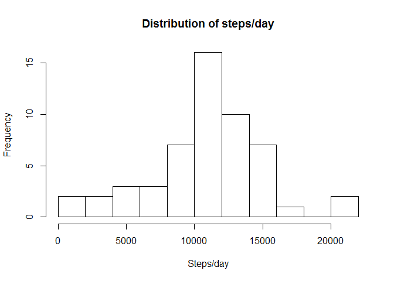
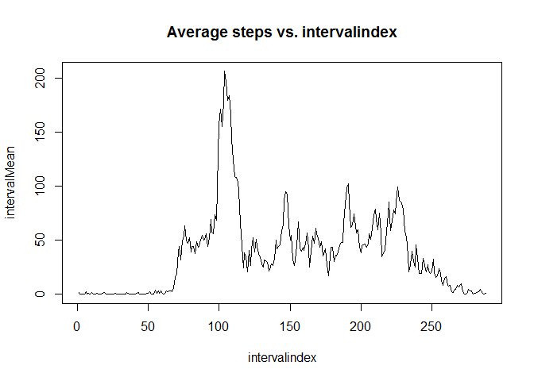
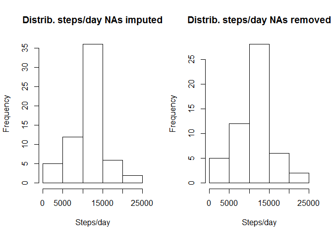
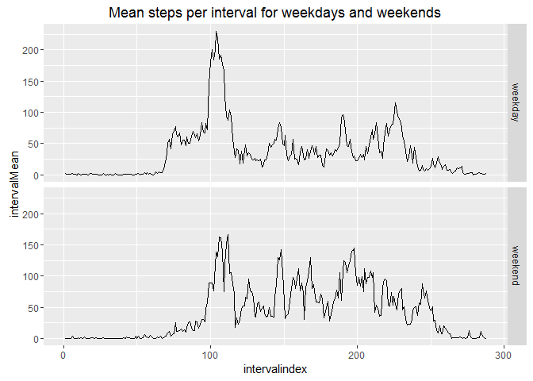

# Course 5 - project 1 - Mobility analysis
Martin Standley  
14. mai 2016  

This analysis was conducted as a student assignment for the Coursera Reproducible
Research course, week 2 project 1.

# Data source

The data comes from a personal activity monitoring device which collects data at 5 minute
intervals through out the day. This data set consists of two months of data from an anonymous
individual collected during the months of October and November, 2012 and
comprise one 3 variable record for each 5 minute interval with
a) the date, b) the start time and c) the number of steps.

The raw data was included in the clone to the working directory from 
http://github.com/rdpeng/RepData_PeerAssessment1 and therefore did not need fetching.

# 1.1. Reading in the data and tidying

The data is unzipped and read in. The date string is converted to Date.


```r
library(dplyr)
```

```
## 
## Attaching package: 'dplyr'
```

```
## The following objects are masked from 'package:stats':
## 
##     filter, lag
```

```
## The following objects are masked from 'package:base':
## 
##     intersect, setdiff, setequal, union
```

```r
library(ggplot2)
# unzip and read data
activity <- read.table(unz("activity.zip", "activity.csv"), header=T, sep=",", stringsAsFactors=FALSE)
# replace stringdates by dates
activity$date <- as.Date(activity[,2])
```

# 1.2. Tidying the interval identifiers
The intervals are identified by their start time coded as HHMM. This coding
is non continuous from hour to hour so we use an intervalindex
which starts with 1 at the start of each day and ends with 288.
We define two functions to convert back and forth and then
add a new intervalindex variable to the dataframe.
 

```r
# define a function index for converting interval (HHMM) to intervalIndex (1:288)
index <- function (interv) {
     # split into HH and MM
     HH <- interv %/% 100
     MM <- interv %% 100
     MM/5 + HH*12 + 1
}
# and reverse function interv to time string
interv <- function (ind) {
     HH <- (ind-1) %/% 12
     MM <- (ind-1) %% 12 *5
     HH*100 + MM
     paste(sprintf("%02d", HH),":",sprintf("%02d", MM), sep = "")
}

# add a variable for interval index within each day
activity$intervalindex <- index(activity$interval)
```

There should be no NAs in dates and intervals. Check:

 * The number of NAs in date is: 0
 * The number of NAs in interval is: 0
 
# 2. Look at the total number of steps for each day
How do the object's days differ from each other?

Ignoring missing values, we group by date and sum the number of steps. 

```r
# filter out NA step counts, group by date and sum steps for each date
dayssums <- summarise(group_by(filter(activity, !is.na(steps)), date), daysum = sum(steps))
hist(dayssums$daysum, main="Distribution of steps/day", xlab="Steps/day", breaks=10)
```

<!-- -->

The histogram indicates that the most typical number of steps per day is 10-12 thousand.

This is confirmed by:

 - the mean number of steps per day: 1.0766189\times 10^{4}
 - the median number of steps per day: 10765
 
But we also see that he has a few "high activity" days that could be worth looking at.

# 3. Average daily activity pattern

We now look at his average activity pattern thoughout the day, again ignoring NAs.


```r
# group by interval, get average for each interval, plot and find interval with biggest mean
intervalAverages <- summarise(group_by(filter(activity, !is.na(steps)), intervalindex), intervalMean = mean(steps))
with (intervalAverages, plot(intervalindex, intervalMean, type="l", main="Average steps vs. intervalindex"))
```

<!-- -->

```r
maxint <- as.integer(arrange(intervalAverages, desc(intervalMean))[1,1])
```

The x-axis is the index of the 5-minute interval numbered from 1 to 288.


The interval with the greatest mean activity has index 104 starting at
08:35. The intervals around this time have averages of 30-40 steps
per minute. 
One hypothesis could be that the object was walking to work,
or walking the dog or taking a child to school.

# 4. Imputing missing values for number of steps

We checked for missing dates and intervals above. There were none.

There are 2304 missing step counts.

We should fill these and check for effects on the distribution skipping NAs.

We choose to fill missing counts with the mean of the same interval.


```r
# Make a copy of the dataset and loop through filling in NAs with means
newActivity <- activity

for (i in 1:nrow(newActivity)) {
     if (is.na (newActivity[i, 1])) {
          newActivity[i, 1] <- intervalAverages[newActivity[i,4], 2]
          } 
     }
```

The number of NAs in the new dataset is 0.

The plots below compare distributions with NAs excluded and then imputed
by putting in mean values.


```r
# make a new histogram of number of steps per day
dayssums2 <- summarise(group_by(newActivity, date), daysum = sum(steps))
par(mfrow=c(1,2))
hist(dayssums2$daysum, main="Distrib. steps/day NAs imputed", xlab="Steps/day" )
hist(dayssums$daysum, main="Distrib. steps/day NAs removed", xlab="Steps/day")
```

<!-- -->

The distributions of the two datasets look similar, except that the frequency of
"typical" days has increased. This is reasonable since we have replaced NAs by
means.

The mean and median when skipping missing values were 1.0766189\times 10^{4} 
and 10765 respectively, whereas they are
1.0766189\times 10^{4} and 1.0766189\times 10^{4} with the 
"impute missing value using interval means" strategy.

# 5. Investigating differences between weekends and weekdays

We add a new factor day with values "weekend" (wday= 0 or 6) or "weekday",
recalculte the intervalmeans for each of the two groups and then plot.


```r
# put in a new factor variable weekday/weekend calculated from date (wday= 0 or 6 is weekend)
newActivity$day <- factor(ifelse(((as.POSIXlt(newActivity$date)$wday %% 6) == 0),"weekend", "weekday"))

# calculate intervalmeans
intervalAverages2 <- summarise(group_by(newActivity, day, intervalindex), intervalMean = mean(steps))

# plot interval means for weekdays and weekends
ggplot(intervalAverages2, aes(intervalindex, intervalMean)) +
     geom_line() +
     ggtitle("Mean steps per interval for weekdays and weekends") +
     facet_grid(day~.)
```

<!-- -->

We see from comparing these plots that the objects' weekdays start with more steps
but have less during the middle of day than at the weekend.

We could hypothesize that the object went to a workplace which was relatively sedentary.
